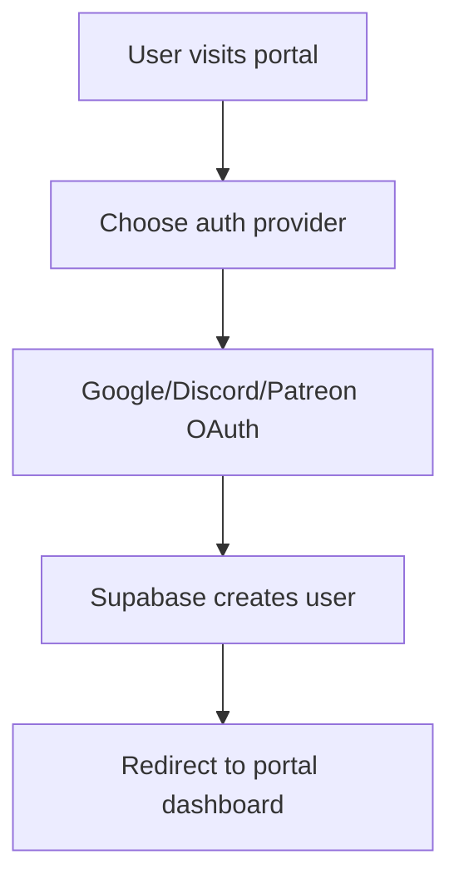
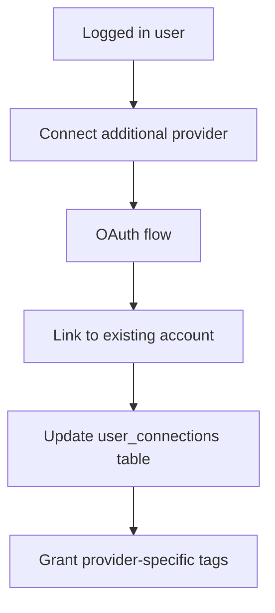
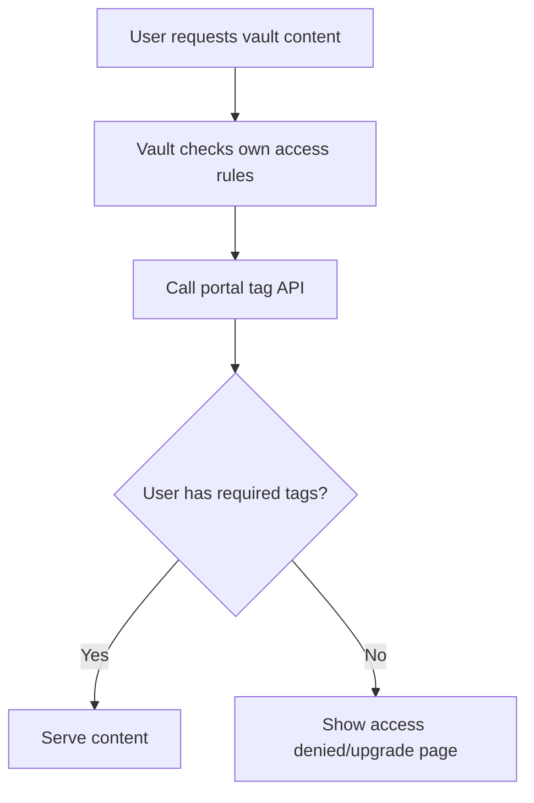

# Nimble Unified Portal - Architecture Design

## Overview

This document outlines the design for a unified portal that provides a landing page and authentication framework for the Nimble RPG ecosystem. **Phase 1 focuses on integrating only the vault and two new placeholder apps, leaving the existing character sheet app untouched.**

## Current State Analysis

### Existing Applications (Unchanged)
- **`apps/web`**: Next.js 14 character sheet application (port 3000) - **UNCHANGED**
- **`apps/api`**: Express.js API with Prisma + PostgreSQL + Google OAuth (port 3001) - **UNCHANGED**
- **`apps/discord`**: Discord bot application - **UNCHANGED**

### Apps for Portal Integration
- **`apps/vault`**: Astro Starlight documentation site (port 4321) - **WILL INTEGRATE**

### New Apps to Create
- **`apps/monster-builder`**: Monster creation tool placeholder - **NEW**
- **`apps/dice-roller`**: Dice rolling utility placeholder - **NEW**

## Design Goals (Simplified Scope)

1. **Portal Landing Page**: Central hub with navigation to tools
2. **Multiple OAuth Providers**: Google, Patreon, Discord integration
3. **User Tag System**: Flexible tagging for content access control
4. **Vault Content Gating**: Restrict vault content based on user tags
5. **Placeholder Apps**: Simple monster builder and dice roller with auth
6. **Independent Character Sheets**: Leave existing web app completely alone

## Proposed Architecture

### Simplified Architecture

Create a new `apps/portal` application that serves as the main entry point and authentication hub.

```
apps/
├── portal/          # New - Main landing page & auth (port 4000)
├── web/            # Character sheets (port 3000) - UNCHANGED 
├── api/            # Current API (port 3001) - UNCHANGED
├── vault/          # Documentation (port 4321) - INTEGRATE AUTH
├── monster-builder/ # New placeholder app (port 4001)
└── dice-roller/    # New placeholder app (port 4002)
```

#### Routing Strategy

**Local Development:**
- **Portal**: `http://localhost:4000/` - Landing page, auth, navigation
- **Character Sheets**: `http://localhost:3000/` - **INDEPENDENT** (existing app)
- **Vault**: `http://localhost:4321/` - **AUTH PROTECTED** (check portal session)
- **Monster Builder**: `http://localhost:4001/` - **AUTH PROTECTED** (new placeholder)
- **Dice Roller**: `http://localhost:4002/` - **AUTH PROTECTED** (new placeholder)

**Production (Vercel):**
- **Portal**: `https://nimble.game/` - Landing page, auth, navigation
- **Character Sheets**: `https://nimble.game/characters` - **INDEPENDENT** (existing app)
- **Vault**: `https://nimble.game/vault` - **AUTH PROTECTED** (rewrite to vault app)
- **Monster Builder**: `https://nimble.game/monsters` - **AUTH PROTECTED** (rewrite to monster app)
- **Dice Roller**: `https://nimble.game/dice` - **AUTH PROTECTED** (rewrite to dice app)

#### Vercel Deployment Strategy
- **Unified Domain**: All apps served from `nimble.game` with path-based routing
- **Rewrite Rules**: Vercel `vercel.json` rewrites to route paths to different apps
- **Shared Authentication**: Same domain = shared cookies/sessions across all apps
- **Independent Deployments**: Each app can be deployed separately while maintaining routing

## Technology Stack

### Portal App (`apps/portal`)
- **Framework**: Next.js 14 with App Router
- **Authentication**: Supabase Auth (replaces current Prisma setup)
- **Database**: Supabase PostgreSQL 
- **Styling**: Tailwind CSS + shadcn/ui (consistent with existing apps)
- **Deployment**: Vercel

### Supabase Integration
- **Authentication**: Built-in OAuth for Google, Discord, and custom Patreon integration
- **Database**: PostgreSQL with real-time capabilities
- **Row Level Security**: For content access control
- **Edge Functions**: For complex auth logic if needed

## Database Schema (Supabase)

### Core Tables

```sql
-- Users table (managed by Supabase Auth)
-- auth.users automatically created by Supabase

-- Extended user profile
CREATE TABLE user_profiles (
  id UUID REFERENCES auth.users(id) PRIMARY KEY,
  display_name TEXT,
  avatar_url TEXT,
  created_at TIMESTAMPTZ DEFAULT NOW(),
  updated_at TIMESTAMPTZ DEFAULT NOW()
);

-- User tags for access control
CREATE TABLE user_tags (
  id UUID DEFAULT gen_random_uuid() PRIMARY KEY,
  user_id UUID REFERENCES auth.users(id) ON DELETE CASCADE,
  tag_name TEXT NOT NULL, -- e.g., 'patreon-patron', 'core-rules-owner', 'discord-member'
  granted_at TIMESTAMPTZ DEFAULT NOW(),
  granted_by UUID REFERENCES auth.users(id), -- Who granted this tag
  expires_at TIMESTAMPTZ, -- Optional expiration
  metadata JSONB, -- Additional tag-specific data
  
  UNIQUE(user_id, tag_name)
);

-- OAuth connections to track multiple auth providers per user
CREATE TABLE user_connections (
  id UUID DEFAULT gen_random_uuid() PRIMARY KEY,
  user_id UUID REFERENCES auth.users(id) ON DELETE CASCADE,
  provider TEXT NOT NULL, -- 'google', 'discord', 'patreon'
  provider_user_id TEXT NOT NULL,
  provider_email TEXT,
  provider_username TEXT,
  connected_at TIMESTAMPTZ DEFAULT NOW(),
  
  UNIQUE(provider, provider_user_id)
);

-- No central content access rules table needed!
-- Each app manages its own content gating by checking the tag API
```

### Migration from Current Prisma Schema

The existing Prisma schema includes character backups and gaming sessions. We'll need to:

1. **Migrate existing users**: Map Google OAuth users to Supabase Auth
2. **Preserve character data**: Keep character backups with new user references
3. **Gaming sessions**: Migrate or redesign session sharing system

## Authentication Flow

### 1. Initial Login


### 2. Account Linking


### 3. Federated Content Access


## User Tag System

### Predefined Tags
- `patreon-patron`: Active Patreon subscriber
- `patreon-tier-1`, `patreon-tier-2`, etc.: Specific patron tiers
- `core-rules-owner`: Has purchased core rules
- `discord-member`: Member of official Discord
- `beta-tester`: Beta access to new features
- `admin`: Administrative privileges

### Tag Management
- **Automatic**: Granted via OAuth (Discord membership, Patreon status)
- **Manual**: Admin-granted for purchases, special access
- **Time-based**: Can have expiration dates
- **Metadata**: Store additional info (tier level, purchase date, etc.)

## Federated Permissions Architecture

### Unified Tag API

The portal provides a simple API that apps can call to check user permissions:

```typescript
// Portal API endpoint: /api/user/tags
// Returns: { tags: string[], expires_at?: string }

// Example responses:
{ "tags": ["patreon-patron", "core-rules-owner", "discord-member"] }
{ "tags": ["admin"], "expires_at": "2024-12-31T23:59:59Z" }
{ "tags": [] } // No special permissions
```

### App-Level Permission Enforcement

Each app manages its own access control by checking the tag API:

#### Vault Example (JWT-based)
```typescript
// apps/vault/src/middleware.ts
import { verifyNimbleAuth, hasTag } from '@nimble/auth-utils';

export async function onRequest(context) {
  const { request, url } = context;
  
  // Define access rules within the vault app
  const accessRules = {
    '/premium/': ['core-rules-owner'],
    '/patreon-only/': ['patreon-patron'],
    '/admin/': ['admin']
  };
  
  // Check if content requires authentication
  const requiredTags = getRequiredTags(url.pathname, accessRules);
  if (!requiredTags.length) return; // Public content
  
  // Verify JWT (no API call needed!)
  const auth = verifyNimbleAuth(request);
  if (!auth || !requiredTags.some(tag => hasTag(auth, tag))) {
    return new Response('Access Denied', { status: 403 });
  }
}
```

#### Monster Builder Example (JWT-based)
```typescript
// apps/monster-builder/src/middleware.ts
import { verifyNimbleAuth, hasTag } from '@nimble/auth-utils';

export async function onRequest(context) {
  const { request, url } = context;
  
  // Verify JWT authentication
  const auth = verifyNimbleAuth(request);
  if (!auth) {
    return redirect('https://nimble.game/login');
  }
  
  // Optional: premium features require specific tags
  if (url.pathname.includes('/premium')) {
    if (!hasTag(auth, 'core-rules-owner')) {
      return new Response('Premium Feature - Upgrade Required', { status: 402 });
    }
  }
  
  // User is authenticated and authorized!
}
```

### Content Organization (Vault Example)
```
vault/src/content/docs/
├── public/              # No middleware check needed
│   ├── getting-started/
│   └── basic-rules/
├── premium/             # Middleware checks for 'core-rules-owner'
│   ├── advanced-rules/
│   └── optional-systems/
├── patreon-only/        # Middleware checks for 'patreon-patron'
│   ├── early-access/
│   └── patron-exclusive/
└── admin/               # Middleware checks for 'admin'
    └── internal-docs/
```

### Benefits of Federated Approach

1. **App Autonomy**: Each app defines its own access rules
2. **Simple API**: Portal only needs to provide tag information
3. **Flexible Rules**: Apps can implement complex logic (AND/OR conditions, path matching)
4. **Performance**: Apps can cache tag responses
5. **Scalability**: No central permissions database to maintain
6. **Debugging**: Easy to see which app is enforcing which rules

## App Integration Points

### Portal → Other Apps
- **JWT Creation**: Portal creates signed JWT with user tags on login
- **Secure Cookie**: JWT set as secure, httpOnly cookie on `.nimble.game` domain
- **No API calls**: Apps verify JWT locally without contacting portal

### App → Portal Integration
- **JWT Verification**: Apps verify signature using shared secret
- **Permission enforcement**: Apps implement their own access rules based on JWT tags
- **Graceful degradation**: Apps show custom "upgrade required" messages
- **Offline capable**: Apps work even if portal is down (until JWT expires)
- **Shared utility**: `@nimble/auth-utils` package for consistent JWT handling

### Character Sheet Integration (Future Phase)
- **Unchanged for now**: Character sheets remain completely independent
- **Future**: Could add optional cloud sync and sharing features
- **No impact**: Portal doesn't affect existing character sheet functionality

## Development Phases

### Phase 1: Portal Foundation (Current Focus)
1. Create `apps/portal` with Next.js + Supabase auth
2. Create `apps/monster-builder` placeholder app
3. Create `apps/dice-roller` placeholder app
4. Set up user tag system and basic content gating
5. Integrate vault with portal authentication

### Phase 2: Enhanced Authentication
1. Add Patreon OAuth integration with tier detection
2. Add Discord OAuth integration
3. Create admin panel for user and tag management
4. Advanced content access rules for vault

### Phase 3: Application Development
1. Build out monster builder functionality
2. Build out dice roller functionality
3. Advanced vault content organization with gating

### Phase 4: Future Integration (Optional)
1. Character sheet cloud sync integration (if desired)
2. Gaming session improvements with new auth system
3. Campaign management tools
4. Encounter builder

## Security Considerations

### Authentication Security
- **JWT validation**: Verify Supabase tokens on each request
- **CSRF protection**: Use SameSite cookies and CSRF tokens
- **Rate limiting**: Prevent brute force attacks
- **Secure headers**: Implement HSTS, CSP, etc.

### Content Protection
- **Server-side validation**: Never rely on client-side access control
- **Audit logging**: Track content access and tag changes
- **Tag validation**: Verify tags are current and valid
- **Graceful errors**: Don't leak information about protected content

### Data Privacy
- **Minimal data collection**: Only store necessary user information
- **GDPR compliance**: Provide data export and deletion
- **Secure connections**: HTTPS everywhere
- **Third-party integration**: Careful handling of OAuth provider data

## Performance Considerations

### Caching Strategy
- **Tag caching**: Cache user tags for short periods
- **Content caching**: Cache vault content with tag-based invalidation
- **CDN integration**: Use Vercel Edge for portal and vault routing

### Database Optimization
- **Indexes**: Proper indexing on user_tags and content_access_rules
- **Connection pooling**: Efficient Supabase connection management
- **Query optimization**: Minimize database calls in auth middleware

## Migration Strategy

### From Current System (Optional - Future Phase Only)

**Note: Migration is NOT needed for Phase 1.** The existing character sheet app and Prisma API continue to work independently.

Migration would only be needed if/when we integrate the character sheet app with the portal:

1. **User migration**: Export current Prisma users to Supabase *(optional future step)*
2. **Character preservation**: Maintain character backup functionality *(optional future step)*
3. **Session compatibility**: Gradual migration from Iron Session to Supabase Auth *(optional future step)*
4. **API compatibility**: Maintain existing API endpoints during transition *(optional future step)*

**Current Phase 1 Approach**: 
- Character sheet app remains completely independent with existing Prisma/Google OAuth
- New portal uses separate Supabase authentication for vault/monster/dice apps only
- No migration required - two authentication systems coexist peacefully

### Rollback Plan
- **Feature flags**: Enable/disable new auth system
- **Dual authentication**: Support both systems during migration
- **Data backup**: Full backup before migration
- **Monitoring**: Comprehensive monitoring during rollout

## Deployment Architecture

### Vercel Configuration

The root `vercel.json` will handle routing between apps:

```json
{
  "rewrites": [
    {
      "source": "/characters/:path*",
      "destination": "https://nimble-web-app.vercel.app/:path*"
    },
    {
      "source": "/vault/:path*", 
      "destination": "https://nimble-vault-app.vercel.app/:path*"
    },
    {
      "source": "/monsters/:path*",
      "destination": "https://nimble-monsters-app.vercel.app/:path*"
    },
    {
      "source": "/dice/:path*",
      "destination": "https://nimble-dice-app.vercel.app/:path*"
    }
  ]
}
```

### Production Architecture

```
Production (nimble.game):
├── / → Portal app (deployed from apps/portal)
├── /characters → Character sheets (rewrite to separate Vercel app)
├── /vault → Vault (rewrite to separate Vercel app, with auth checks)
├── /monsters → Monster builder (rewrite to separate Vercel app, with auth checks)
└── /dice → Dice roller (rewrite to separate Vercel app, with auth checks)

Supabase Project:
├── Auth service (Google, Discord, Patreon OAuth)
├── PostgreSQL database (user profiles, tags, content rules)
└── Edge functions (if needed for complex auth logic)

Vercel Apps:
├── nimble-portal (apps/portal) - Main domain
├── nimble-web-app (apps/web) - Character sheets (unchanged)
├── nimble-vault-app (apps/vault) - Documentation
├── nimble-monsters-app (apps/monster-builder) - Monster builder
└── nimble-dice-app (apps/dice-roller) - Dice roller
```

### Supabase + Custom JWT Flow

Supabase already uses JWTs internally. We'll use a hybrid approach:

1. **User logs in** at `nimble.game` (portal app) via Supabase Auth
2. **Supabase sets standard auth session** (access_token + refresh_token)
3. **Portal creates additional custom JWT** containing user tags and sets as secure cookie
4. **User navigates** to `/vault`, `/monsters`, or `/dice`
5. **Vercel rewrites** request to appropriate app
6. **Target app middleware** reads custom JWT cookie and verifies signature
7. **If JWT valid**, extract tags from payload and enforce access rules
8. **If authorized**, serve content; **if not**, show upgrade page or redirect to login

### Why Custom JWT + Supabase?

**Option 1: Extend Supabase JWT** (More complex)
- Modify Supabase JWT claims to include custom tags
- Requires custom Supabase Edge Functions or database triggers
- Complex to manage tag updates

**Option 2: Custom JWT alongside Supabase** (Recommended)
- Use Supabase for core authentication (login/logout/session management)
- Create separate custom JWT for tags and permissions
- Portal manages tag updates independently
- Simpler to implement and maintain

### JWT Payload Specification

```typescript
// JWT Payload (signed by portal):
{
  "sub": "user-uuid",                    // User ID
  "iss": "nimble-portal",               // Issuer
  "aud": ["vault", "monsters", "dice"], // Valid audiences
  "exp": 1735689599,                    // Expiration timestamp
  "iat": 1735603199,                    // Issued at timestamp
  "tags": ["patreon-patron", "core-rules-owner"], // User permissions
  "tag_expires": {                      // Optional: per-tag expiration
    "patreon-patron": 1735689599
  }
}

// Cookie format:
// nimble-auth=eyJhbGciOiJIUzI1NiIsInR5cCI6IkpXVCJ9.eyJ...
```

### App Integration Examples

```typescript
// Shared JWT verification utility (can be npm package)
import jwt from 'jsonwebtoken';

interface NimbleJWT {
  sub: string;
  tags: string[];
  tag_expires?: Record<string, number>;
  exp: number;
}

function verifyNimbleAuth(request: Request): NimbleJWT | null {
  const cookie = getCookie(request, 'nimble-auth');
  if (!cookie) return null;
  
  try {
    return jwt.verify(cookie, process.env.NIMBLE_JWT_SECRET) as NimbleJWT;
  } catch {
    return null;
  }
}

function hasTag(auth: NimbleJWT, tag: string): boolean {
  if (!auth.tags.includes(tag)) return false;
  
  // Check if tag has expired
  if (auth.tag_expires?.[tag] && auth.tag_expires[tag] < Date.now() / 1000) {
    return false;
  }
  
  return true;
}
```

### Implementation in Portal App

```typescript
// Portal: After successful Supabase login
import jwt from 'jsonwebtoken';
import { createServerClient } from '@supabase/ssr';

export async function POST(request: Request) {
  const supabase = createServerClient(/* ... */);
  
  // Get authenticated user from Supabase
  const { data: { user }, error } = await supabase.auth.getUser();
  if (error || !user) {
    return new Response('Unauthorized', { status: 401 });
  }
  
  // Fetch user tags from our database
  const { data: userTags } = await supabase
    .from('user_tags')
    .select('tag_name, expires_at')
    .eq('user_id', user.id);
  
  // Create custom JWT with tags
  const nimbleToken = jwt.sign(
    {
      sub: user.id,
      iss: 'nimble-portal',
      aud: ['vault', 'monsters', 'dice'],
      tags: userTags.map(t => t.tag_name),
      tag_expires: userTags.reduce((acc, t) => {
        if (t.expires_at) acc[t.tag_name] = new Date(t.expires_at).getTime() / 1000;
        return acc;
      }, {}),
      exp: Math.floor(Date.now() / 1000) + (24 * 60 * 60), // 24 hour expiry
    },
    process.env.NIMBLE_JWT_SECRET
  );
  
  // Set secure cookie
  return new Response('OK', {
    headers: {
      'Set-Cookie': `nimble-auth=${nimbleToken}; HttpOnly; Secure; SameSite=Lax; Domain=.nimble.game; Path=/; Max-Age=86400`
    }
  });
}
```

### Benefits of Supabase + Custom JWT

1. **Best of both worlds**: Supabase handles OAuth complexity, we handle permissions
2. **No API calls**: Zero latency for permission checks
3. **Offline capable**: Apps work without portal connectivity  
4. **Stateless**: No session storage needed in apps
5. **Secure**: Cryptographically signed, tamper-proof
6. **Flexible**: Easy to update tags without touching Supabase
7. **Simple**: Clean separation of concerns

## Questions & Decisions

### Answered by this Design:
1. **Separate portal app**: Yes, for better separation of concerns
2. **Supabase vs Prisma**: Supabase for unified auth, keep Prisma for complex app-specific data
3. **Routing strategy**: Reverse proxy from portal to specialized apps
4. **Content gating**: Server-side middleware with tag-based access control

### Open Questions for Discussion:
1. **Migration timeline**: How quickly do we need to migrate existing users?
2. **Patreon integration**: Do we need real-time tier updates or periodic sync?
3. **Pricing tiers**: What content should be gated behind which tags?
4. **Mobile apps**: How does this affect the existing Capacitor mobile app?
5. **Offline access**: Should vault content be available offline for authenticated users?

## Next Steps

1. **Review and approval**: Discuss this design with stakeholders
2. **Supabase setup**: Create project and configure OAuth providers
3. **Portal app creation**: Initialize apps/portal with basic structure
4. **Prototype**: Build minimal viable portal with Google OAuth
5. **Integration testing**: Test auth flow between portal and vault

---

*This design provides a scalable foundation for the Nimble ecosystem while maintaining the existing applications' independence and functionality.*